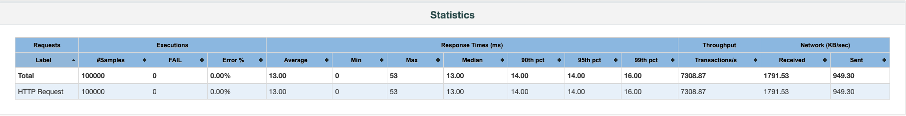
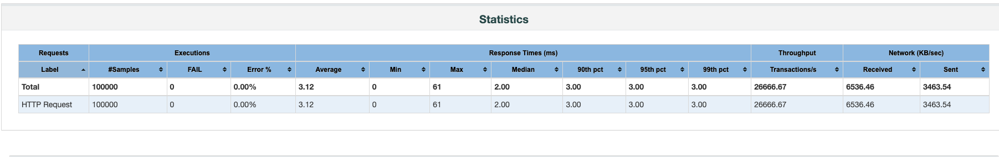

# Description
The httpserver-cpp is a library written in pure C++11 based on Boost.Beast. <br>
The aim is to create a easy-to-use and cross-platform C++ lib which can help the C++ developers to quickly build their own embedded http server.

# Support feature
- Thread pool
- Platform independent
- HTTP request timeout
- HTTP persistent connection (for HTTP/1.1)
- HTTP GET/POST.
- HTTP URL decode and parse.
- HTTP gzip compression.
- Fast logger
- Synchronous and Asynchronous request handling.

# Not support feature
- Http chunked.
- Http SSL.

# How to build
```
mkdir build && cd build
# This flag generates a `compile_commands.json` file for integration with tools like clangd.
cmake -DCMAKE_EXPORT_COMPILE_COMMANDS=ON ..

# Use `make -jN` to speed up the build process, where `N` is the number of parallel jobs.
make -j4

# Now build the docs target, which generates the documentation.
# This requires Doxygen version 1.14.0 to be installed on your system.
# If you don't have Doxygen installed, you can skip this step.
# ref: https://github.com/doxygen/doxygen
# docs output will be built in the build/docs directory
cmake -DBUILD_DOCS=ON ..
cmake --build . --target docs
```

# Simple http server
It only needs several minutes for a developer create his/her own http server application with the library.<br>
Below is a very simple sample which only contains one main() function.
```
#include <sstream>
#include <httpserver/http_server.h>

using namespace http::server;

class HelloHandler : public APIHandler
{
public:
    HelloHandler() = default;
    virtual ~HelloHandler() = default;

    virtual void handle(HttpRequest&& request, HttpResponseWriter&& response_writer) noexcept
    {
        auto method = request.method();

        std::stringstream ss;

        // request method
        ss << "receive method: " << static_cast<int>(request.method()) << std::endl;

        // request body
        ss << "receive body: " << request.body() << std::endl;

        // request parms
        for (auto& p : request.params())
        {
            ss << "receive param: " << p.first << ":" << p.second << std::endl;
        }

        // request headers
        for (auto& h : request.headers())
        {
            ss << "receive header: " << h.first << ":" << h.second << std::endl;
        }

        // create response
        auto status = StatusType::OK;
        auto body = ss.str();
        auto content_type = "text/plain";
        auto rsp = HttpResponse(status, std::move(body), std::move(content_type));

        // write response
        response_writer.send(std::move(rsp));
    }
};

int main()
{
    // set log level
    setLogLevel(LogLevel::Info);
    auto server = HttpServer();
    server.registerHandler("/hello", new HelloHandler());
    server.run();
}
```

# Configure http server
```
auto opts = HttpServerOptions();
opts.add_ = "127.0.0.1";    // http server ipv4 addr
opts.port_ = 5000;          // http server ipv4 addr port, default 6000
opts.thread_num_ = 3;       // http server work thread number, default 1
opts.read_time_out_ = 3; // read req timeout, uint:seconds, default 60s, 0 means not timeout
opts.write_time_out_ = 3; // write rsp timeout, uint:seconds, default 60s, 0 means not timeout
opts.auto_gzip_ = true;     // when the accept_encoding of request is set and auto_gzip_ is true, server automatically gzip the response body
opts.max_request_size_ = 1024*1024; // http request max length, if it overflow, will close the connection, default 2MB

auto server = HttpServer(opts);

//...
server.run();
```

# http server Logger
## http server default log format
```
Logger format: time|level|thead_id|message|file|line|
Example: 2024-05-09T17:47:30.175|I|20534011|This message should be displayed..|test.cpp|line#25|
```

## Use http server Logger
http server export some logger macro functions, user can use these functions to write your own logs.<br>
These macro functions has only one string input parameter.<br>
```
LOG_LOGGER_TRACE("trace message");
LOG_LOGGER_DEBUG("debug message");
LOG_LOGGER_INFO("info message");
LOG_LOGGER_WARN("warning message");
LOG_LOGGER_ERROR("error message");
LOG_LOGGER_CRITICAL("critical message");
```
You can customize fmt functions yourself, or you can use third-party fmt functions.<br>
Below is a example using fmt library, if your prefer this format, you should import fmt library fist.<br>
[fmt library](https://github.com/fmtlib/fmt)
```
LOG_LOGGER_INFO(fmt::format("this is a info id{}", 1));
```

## Enable file logger
default log is written to console, you can write log to files.

```
auto opts = LogOptions();
opts.enable_file_mode_ = true;  // enable file mode
opts.file_mode_options_.file_name_ = "http_server_test_log.txt";
opts.file_mode_options_.truncate_ = true;  // truncate when file exist, works on rotating disable
opts.enable_console_mode_ = true;  // enable console mode, logs will be written to files and console

// init logger with options
initLog(opts);
setLogLevel(LogLevel::Info);

//...
server.run();
```

## Enable file rotating logger
```
auto opts = LogOptions();
opts.enable_file_mode_ = true;  // enable file mode
opts.file_mode_options_.file_name_ = "http_server_test_log.txt";
opts.file_mode_options_.truncate_ = false;
opt.file_size_ = 300 * 1024 * 1024;  // rotating logger with the file size, 0 means disable rotating
opt.file_count_ = 3;                 // rotating max files count, 0 means disable rotating
opts.enable_console_mode_ = true;  // enable console mode, logs will be written to files and console

// init logger with options
initLog(opts);
setLogLevel(LogLevel::Info);

//...
server.run();
```

# Echo Test Report
Echo Test：
- Active user: 100
- Request loops: 1000
- Total request: 100*1000=100000

## case1: thread number 1


## case2: thread number 8


